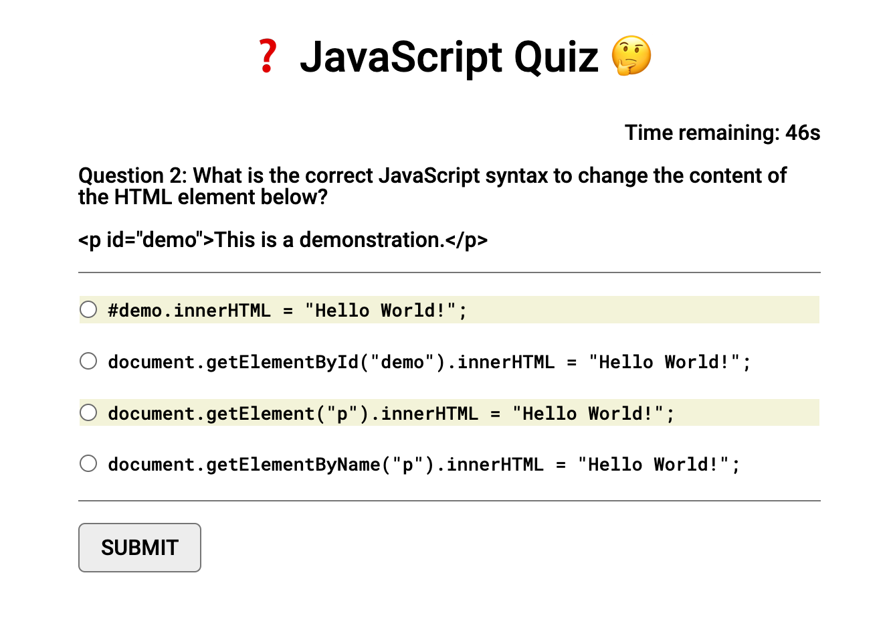

# JavaScript Code Quiz

## Description

Test your JavaScript knowledge with this Code Quiz!
Compete with your friends and colleagues to see who can get the highest score in the shortest amount of time!

Click `START` to begin and answer the multiple choice questions as they appear. But be careful! Wrong answers will incur a time penalty! 😱

The live site can be viewed [here](https://llourn.github.io/javascript-code-quiz/).

## Table of Contents

- [Installation](#installation)
- [Credits](#credits)
- [License](#license)

## Installation

In addition to downloading the repo, you will need to either host this somewhere or spin up a local web server to run this app. The easiest way to do that is to open the project in VSCode and run the `index.html` file using the `Live Server` extension.

This is due to the use of `fetch` to retrieve the questions from a JSON file stored within the project.

## Credits

Obtained the reset.css file from http://meyerweb.com/eric/tools/css/reset/

Quiz questions from https://www.w3schools.com/quiztest/quiztest.asp?qtest=JS

## License

MIT License Copyright (c) 2023 Lorne Cyr

## Badges

